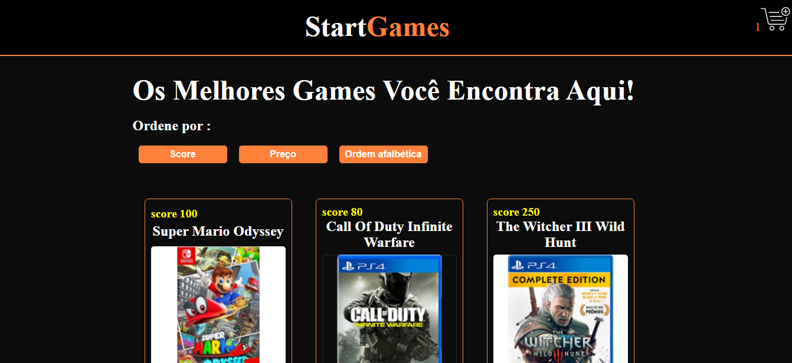

### GameStar

### Skills:
<ul>
    <li>React</li>
    <li>Styled-components</li>
    <li>Axios</li>
    <li>ContextApi</li>
    <li>React-Icons</li>
</ul>

## Como rodar:

* No raiz do projeto, entre powershell e dige: "json-server --watch db.json --port 3333"
*Em seguida abra outra janela do powershell e na raiz do projeto degite: "npm start"S
